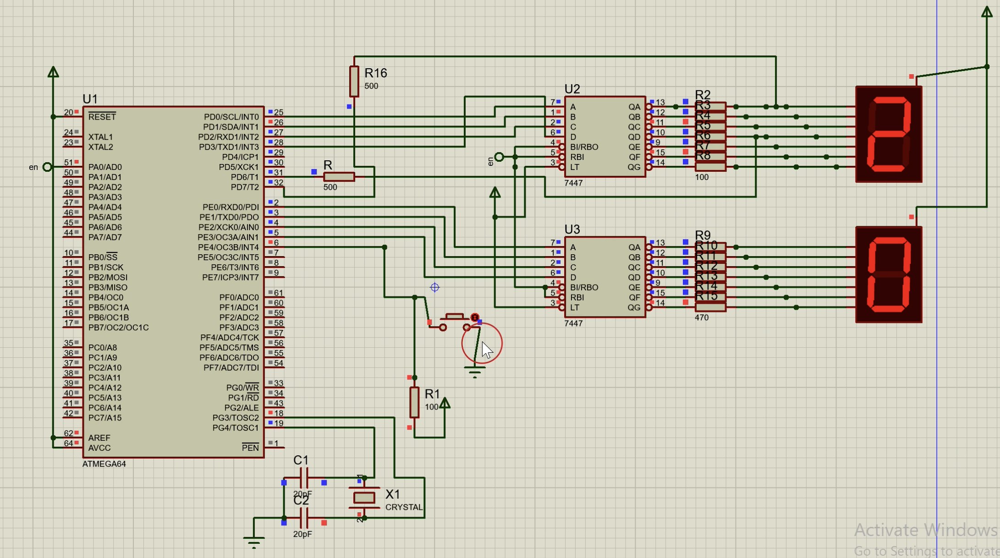

# ATmega64 Stopwatch (Assembly)

This repository contains a stopwatch program written in assembly language for the ATmega64 microcontroller. The program simulates a stopwatch functionality using the timer interrupts and GPIO operations.

## Features

- Stopwatch functionality: Start, stop, and reset.
- Timer interrupts for precise timing.

## Requirements

To run the program, you will need:
- ATmega64 microcontroller or compatible development board.
- AVR toolchain for assembly language programming.
- Simulation environment (e.g., Proteus) if you wish to simulate the program.

## Getting Started

1. Clone the repository to your local machine:

2. Open the project in your preferred AVR assembly IDE or text editor.

3. Compile the assembly code using your AVR toolchain.

4. Flash the compiled binary onto your ATmega64 microcontroller.

5. Connect necessary peripherals (e.g., LEDs, buttons) as per the circuit design.

6. Run the program on your microcontroller.

## Circuit Design

The repository includes simulation files and photos in Proteus for visualizing the circuit design.

## Usage

- Press a button to start/stop the stopwatch.
- Use another button to reset the stopwatch.

## Contributions

Contributions to enhance the functionality, optimize the code, or add new features are welcome! Fork the repository, make your changes, and submit a pull request.

## License

This project is licensed under the [MIT License](LICENSE).

## Acknowledgments

- Thanks to [Proteus](https://www.labcenter.com/) for the simulation environment.
- Special thanks to contributors and the AVR community for resources and support.

